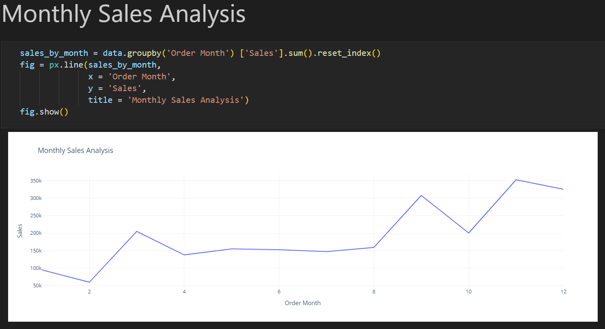
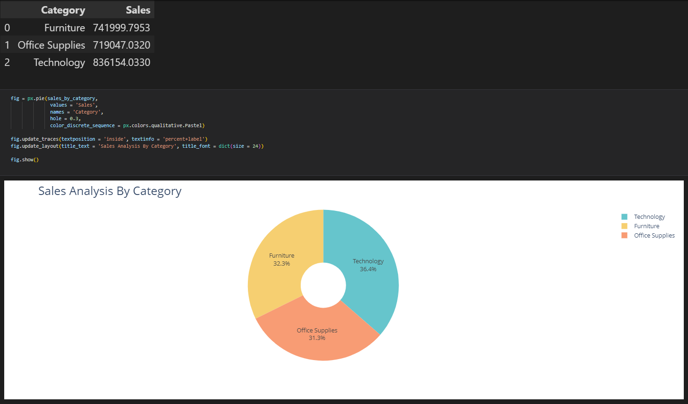
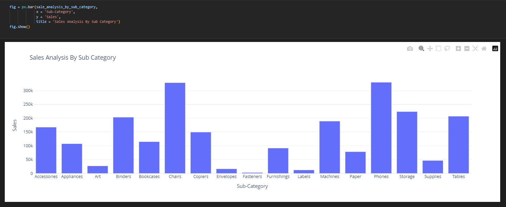
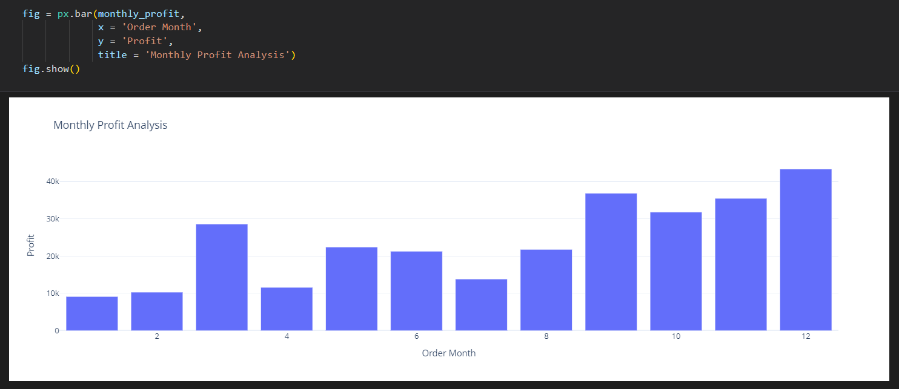
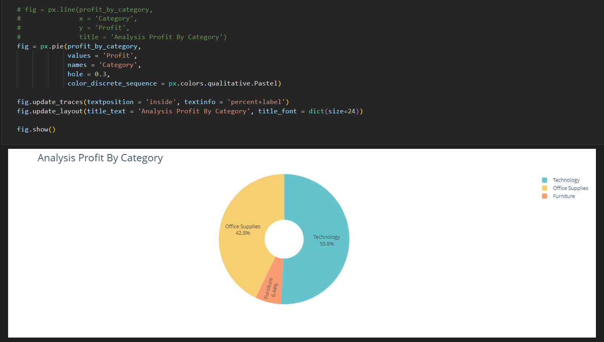
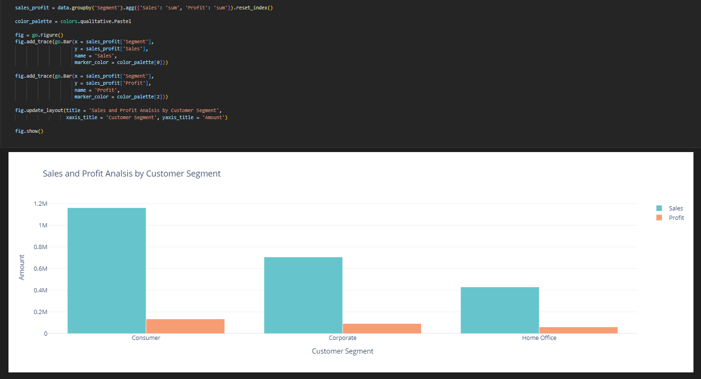
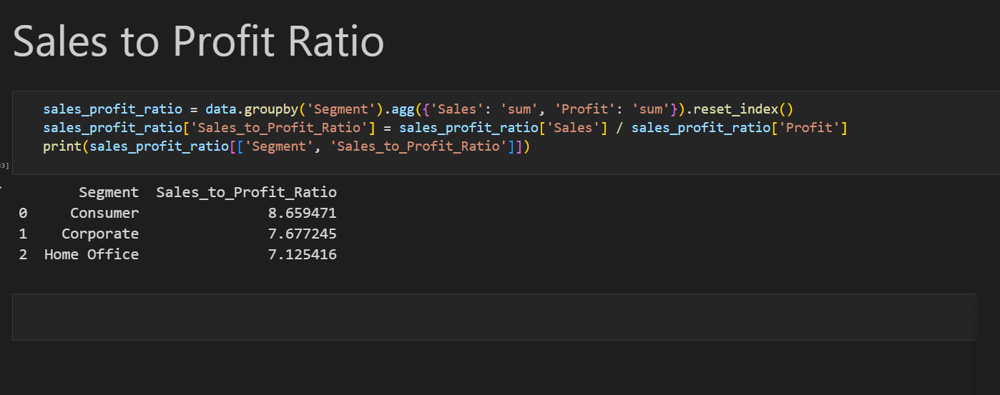

# E-Commerce Sales Analysis Dashboard

This project presents a comprehensive dashboard created using Python and Jupyter Notebook, analyzing the performance of an e-commerce store across various metrics such as sales, profit, product categories, and customer segments. The analysis is designed to provide actionable insights for decision-making.

## Features
- **Monthly Sales Analysis**: Identifies the months with the highest and lowest sales.
- **Category and Sub-Category Analysis**: Highlights the best and worst-performing categories and sub-categories based on sales and profit.
- **Profit Analysis**: Determines the monthly profit trends and the most profitable periods.
- **Customer Segments**: Analyzes sales and profit distribution across different customer segments.
- **Sales-to-Profit Ratio**: Evaluates the efficiency of sales in generating profit.

## Analysis Questions Addressed
1. **Monthly Sales**:
   - Calculate monthly sales and identify the months with the highest and lowest sales.
    
2. **Category Analysis**:
   - Analyze sales based on product categories to determine the best and worst performers.
    
3. **Sub-Category Analysis**:
   - Perform a detailed analysis of sub-categories to identify key insights.
    
4. **Monthly Profit Trends**:
   - Determine which months had the highest profit.
     
5. **Category and Sub-Category Profit Analysis**:
   - Evaluate the profitability of each category and sub-category.
    
    .png)
6. **Customer Segment Analysis**:
   - Assess sales and profit distribution across various customer segments.
    
7. **Sales-to-Profit Ratio**:
   - Analyze the efficiency of sales in generating profit.
   

## How to Use
1. Clone this repository to your local machine.
2. Open the Jupyter Notebook file to explore the analysis.
3. Review the detailed visualizations and insights.

## Technologies Used
- **Python:** For data analysis and visualization.
- **Jupyter Notebook:** For creating and sharing the dashboard.
- **Pandas and NumPy:** For data manipulation and analysis.
- **Matplotlib and Seaborn:** For creating visualizations.

## Acknowledgements
Special thanks to the e-commerce dataset and resources used for building this project.

